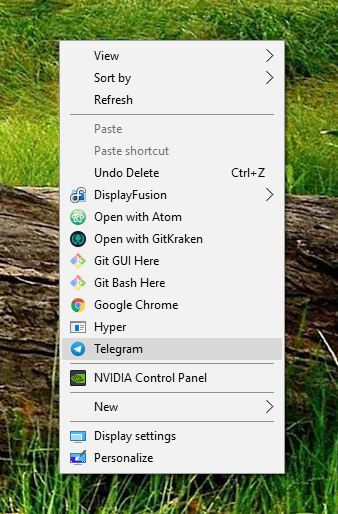

# Desktop Context

A simple node library to add programs to your Windows desktop context menu.

In other words, this allows you to right click your desktop and select a program, which you've added via this script, to open.

## Installation

`npm install desktop-context` or `yarn add desktop-context`

## Example

### Adding a program

```JavaScript
const desktopContext = require('desktop-context');

desktopContext.addProgram(
  "Telegram",
  "C:\\Users\\Hawkins\\AppData\\Roaming\\Telegram Desktop\\Telegram.exe"
);
```



### Removing a program

```JavaScript
const desktopContext = require('desktop-context');

desktopContext.removeProgram("Telegram");
```
